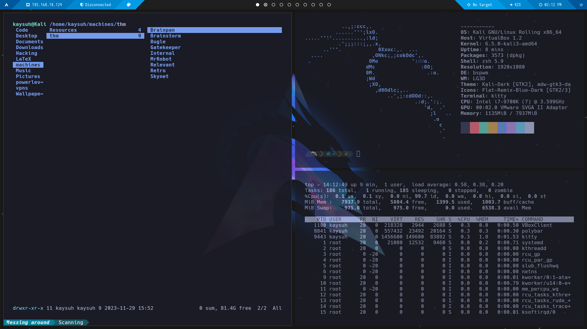

# Customization

## Overview:

## Instructions:
Make sure you modify the script **setup.sh** before you run it, the part where you have to change and add the name of the wallpaper and colour schema you want is very noticeable, I ensure you. You can check the assets folder to see which ones are available!

## How to change Colour Schema
We'll rely on pywal feature. In order to change colour schema and get it auto-generated for the background you want you'll have to do as follows:
- wal -a 80 -b #\<HexBackgroundColourForTTY> -i /home/user/Wallpapers/\<archkali*.png>
- Next step should be taking a look at: .cache/wal/colors-kitty.conf and modify in .config/kitty/kitty.conf the active and inactive tab backgrounds using those colours to match everything
- This colours come predefined the same as Amber,Red,Teal and Blue themes from polybar (all of which are followed by "-dark") so you can choose between those and the wal autogenerated's palettes will match your polybar.

## For laptop users:
There's a module called "battery" within the .config/polybar/shapes/modules.ini file. You'll have to add the module to the config.ini file and set it up following the defined estructure. You'll have to modify the following files: glyphs, modules and config.ini. You can modify the color schema for polybar in the file colors.ini opening with nvim you'll be able to see the hex colours while editing. If you've never used polybar it could be a bit confusing but you'll find out how to follow the pattern after a few minutes of reading the code.

## Shortcuts BSPWM

- <kbd>Windows</kbd> + <kbd>Enter</kbd>: Open a terminal emulator window (kitty). 
- <kbd>Windows</kbd> + <kbd>W</kbd>: Close the current window.
- <kbd>Windows</kbd> + <kbd>Alt</kbd> + <kbd>R</kbd>: Restart the bspwm configuration.
- <kbd>Windows</kbd> + <kbd>Alt</kbd> + <kbd>Q</kbd>: Log out.
- <kbd>Windows</kbd> + <kbd>(⬆⬅⬇➡)</kbd>: Navigate through windows in the current workspace.
- <kbd>Windows</kbd> + <kbd>D</kbd>: Open Rofi. Press Esc to exit.
- <kbd>Windows</kbd>+ <kbd>(1,2,3,4,5,6,7,8,9,0)</kbd>: Switch to the respective workspace.
- <kbd>Windows</kbd> + <kbd>T</kbd>: Change the current window to tile mode.
- <kbd>Windows</kbd> + <kbd>M</kbd>: Toggle the current window to "full" mode (doesn't occupy the polybar). Press the same keys to return to tile mode.
- <kbd>Windows</kbd> + <kbd>F</kbd>: Change the current window to fullscreen mode (occupies the entire screen, including the polybar).
- <kbd>Windows</kbd> + <kbd>S</kbd>: Change the current window to floating mode.
- <kbd>Windows</kbd> + <kbd>Shift</kbd> + <kbd>(1,2,3,4,5,6,7,8,9,0)</kbd>: Move the current window to another workspace.
- <kbd>Windows</kbd> + <kbd>Alt</kbd> + <kbd>(⬆⬅⬇➡)</kbd>: Resize the current window (only works if it's in floating mode).
- <kbd>Windows</kbd> + <kbd>Ctrl</kbd> + <kbd>(⬆⬅⬆➡)</kbd>: Change the position of the current window (only works if it's in floating mode).
- <kbd>Windows</kbd> + <kbd>Shift</kbd> + <kbd>F</kbd>: Open Firefox.
- <kbd>Windows</kbd> + <kbd>Shift</kbd> + <kbd>B</kbd>: Open Burpsuite.
- <kbd>Ctrl</kbd> + <kbd>Alt</kbd> + <kbd>L</kbd>: Lock the screen.
- <kbd>Ctrl</kbd> + <kbd>Shift</kbd> + <kbd>⬆⬇</kbd>: Increase/decrease volume.
- <kbd>Ctrl</kbd> + <kbd>Shift</kbd> + <kbd>M</kbd>: Mute/unmute volume.
- <kbd>Windows</kbd> + <kbd>Ctrl</kbd> + <kbd>Alt</kbd> + <kbd>(⬆⬅⬇➡)</kbd>: Show a preselection and then open a window (kitty, Firefox, File manager, etc.).
- <kbd>Windows</kbd> + <kbd>Ctrl</kbd> + <kbd>Alt</kbd> + <kbd>Space</kbd>: Undo the preselection.
- <kbd>Ctrl</kbd> + <kbd>Shift</kbd> + <kbd>Enter</kbd>: Open a sub-window in the current window.
- <kbd>Ctrl</kbd> + <kbd>Shift</kbd> + <kbd>Z</kbd>: Zoom in on the current sub-window.
- <kbd>Ctrl</kbd> + <kbd>(⬆⬅⬇➡)</kbd>: Navigate between sub-windows in the current window.
- <kbd>Ctrl</kbd> + <kbd>Shift</kbd> + <kbd>R</kbd>: Resize the current sub-window. Afterward, use:
  - <kbd>W</kbd> for 'Wider'
  - <kbd>N</kbd> for 'Narrower'
  - <kbd>T</kbd> for 'Taller'
  - <kbd>S</kbd> for 'Shorter'
  - <kbd>R</kbd> for 'Reset'
- <kbd>Esc</kbd> to quit resize mode.
- <kbd>Ctrl</kbd> + <kbd>Shift</kbd> + <kbd>L</kbd>: Toggle the arrangement of sub-windows.
- <kbd>Ctrl</kbd> + <kbd>Shift</kbd> + <kbd>W</kbd>: Close the current sub-window or tab.
- <kbd>Ctrl</kbd> + <kbd>Shift</kbd> + <kbd>T</kbd>: Open a tab in the current window.
- <kbd>Ctrl</kbd> + <kbd>Shift</kbd> + <kbd>Alt</kbd> + <kbd>T</kbd>: Rename the title of the current tab.
- <kbd>Ctrl</kbd> + <kbd>Shift</kbd> + <kbd>(⬅➡)</kbd>: Navigate between current tabs.
- <kbd>Ctrl</kbd> + <kbd>Shift</kbd> + <kbd>C</kbd>: Copy to the clipboard.
- <kbd>Ctrl</kbd> + <kbd>Shift</kbd> + <kbd>V</kbd>: Paste from the clipboard.
- <kbd>F1</kbd>: Copy to buffer A.
- <kbd>F2</kbd>: Paste from buffer A.
- <kbd>F3</kbd>: Copy to buffer B.
- <kbd>F4</kbd>: Paste from buffer B.

  ## Extra:
  
  Dont' forget you're free to change the bspwmrc and wall files to modify the behaviour of the system every time you reload the BSPWM.
  You should also install:
  - [NVIM](https://nvchad.com/) first time you run it, you'll have to install the stuff. Just type N first input and later after everything is installed if you find any trouble while working with .sh files, open both nvims root and user and type: TSInstall all and let it finish. It'll solve your parse issues.
  - [FZF](https://github.com/junegunn/fzf) for root user 
  

  ## About
  Credit for the user [r1vs3c](https://github.com/r1vs3c) he develop the original script, I have improved it, adding pretty much everything I'll need for qol in a fresh Kali machine, and modify the colours since I like variety and I get tired of the same style if I look at it too many hours during the days :P 
